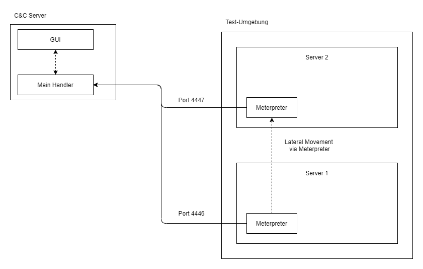
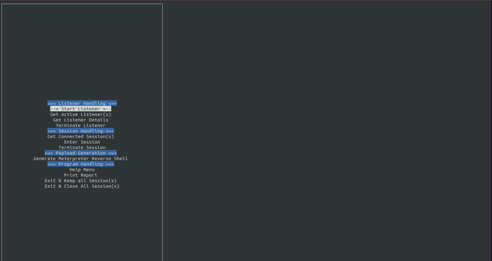
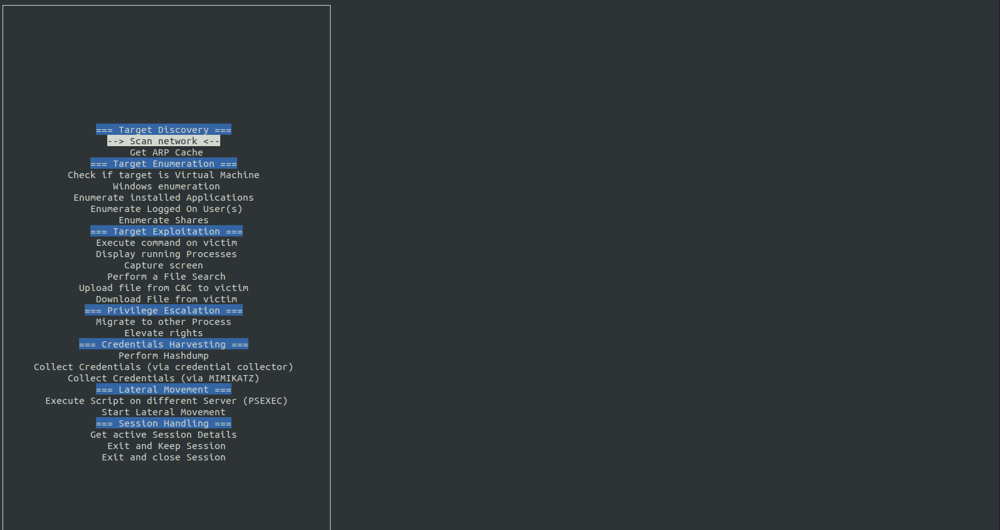
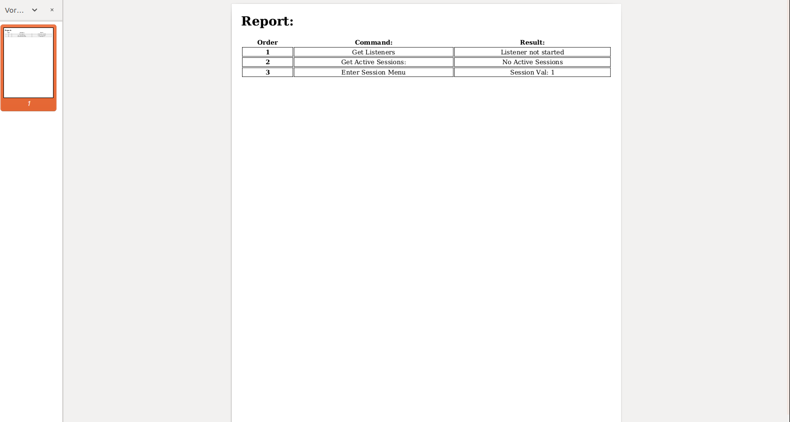

# lmf

## Prerequisites

```sh
# Download Repo
git clone https://github.com/DanMcInerney/pymetasploit3
cd pymetasploit3


# install python
apt-get install python3
apt-get install python-setuptools
pip3 install pdfkit
pip3 install Jinja2
pip3 install pandas
apt install -y wkhtmltopdf

# install the pymetasploit repo
python setup.py install
apt install python-pip3
pip3 install pymetasploit3


# the following command should work
msfrpcd -h


```

## Test Setup



## Usage

### start the RPC Listener

```sh

msfrpcd -P password -f -p 5000 -S

```

### Run Main

```sh

python3 main.py

```

## Screens





